<p align="center">
  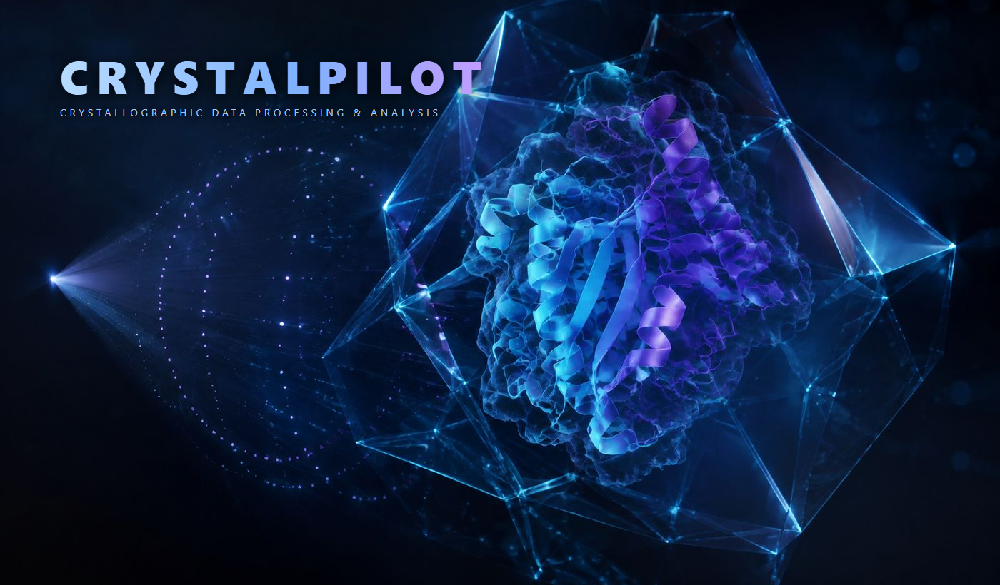
</p>

# CrystalPilot

[](https://doi.org/10.5281/zenodo.22756729)

**Crystallographic data processing & analysis: a browser interface for XDS.**

CrystalPilot aims to make X-ray data processing user-friendly and consolidated in one interface. It manages projects, handles your data and the XDS input files, and follows the processing from the images to a merged data set. Along the way it builds "Table 1" automatically. Its work modes, from Tutorial to Expert, also make it a platform for learning data processing. It runs on Linux, and on Windows through WSL2 with a one-click installer.

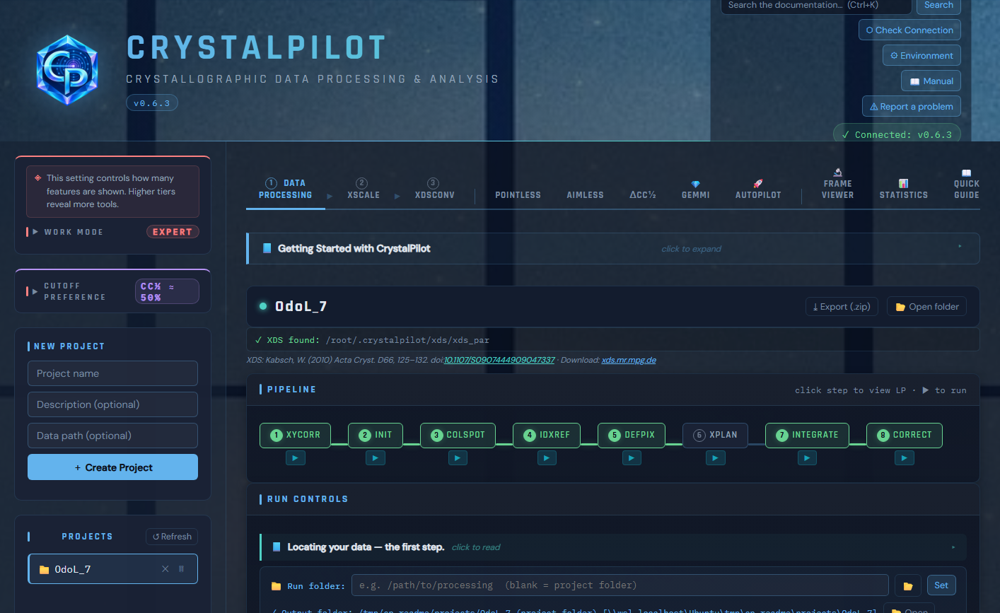

## What it does

- **Project management.** Each data set is a project with its own folder, run history and results. Recent folders and image templates are remembered.
- **XDS pipeline.** Run it step by step (XYCORR → CORRECT), to IDXREF, Integrate & Correct, or all at once, with a live log.
- **XDS.INP and XSCALE.INP editors.** Key parameters as fields, written from the image headers or filled from CORRECT.LP; the full files are one tab away.
- **Results read for you.** Key values of IDXREF.LP, CORRECT.LP and XSCALE.LP are pulled out, highlighted and graphed.
- **Resolution cut-offs.** I/σ ≈ 2, R-obs ≈ 55 %, CC½ ≈ 50 % and CC½ significance are marked directly on the statistics and applied in one click.
- **AutoPilot.** Processes single data sets or whole batches unattended, including iterative auto-indexing strategies.
- **Table 1** built from the processing statistics, ready to copy into a paper.
- **ΔCC½ frame rejection, POINTLESS, AIMLESS, XDSCONV and gemmi** for the steps after scaling.
- **Frame viewer** for Eiger HDF5, CBF and IMG frames.

## Work modes

Four levels, from Tutorial to Expert, set how much of the program you see: the tabs, the input keywords offered in the editors, and the analyses and graphs shown. Beginners start with the essentials and add tools as they learn; a higher level only adds, it never removes anything.

<table>
<tr><td width="320">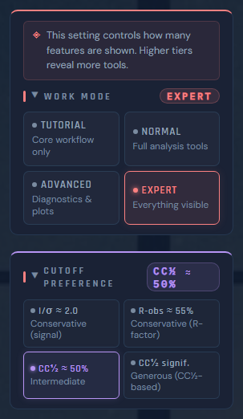</td>
<td>

**Tutorial**
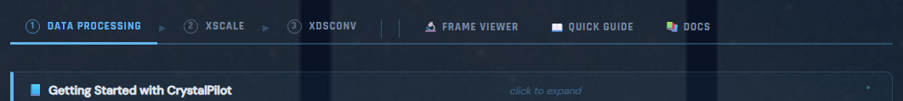

**Normal**
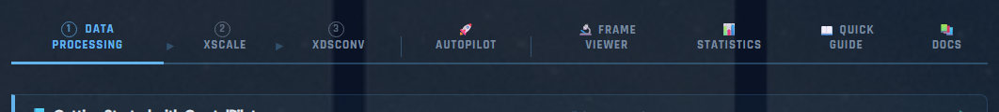

**Advanced**
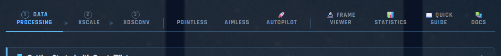

**Expert**
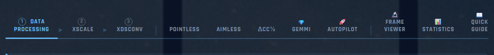

</td></tr>
</table>

The **Cutoff Preference** (under the work mode) sets the resolution criterion used whenever CrystalPilot proposes a cut-off.

## Screenshots

All screenshots come from a real data set: EIGER 16M, 1800 images at 0.2°, C222₁.

### XDS.INP editor

The XDS.INP keywords are laid out as fields, each with a switch to make it active or commented, and the file can be written from the image headers.

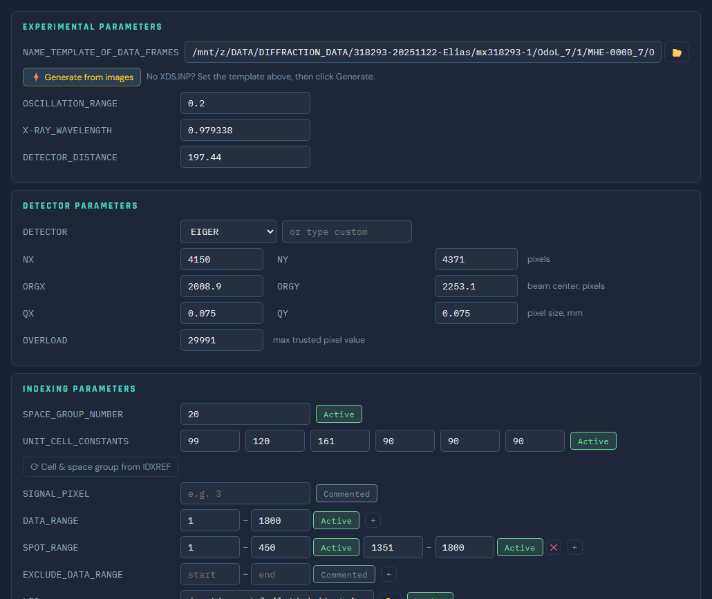

### IDXREF.LP

The indexing outcome is summarised with the key values colour-coded: indexed fraction, spot and spindle deviations, refined beam centre and distance, plus the Bravais lattice table with the suggested lattice.

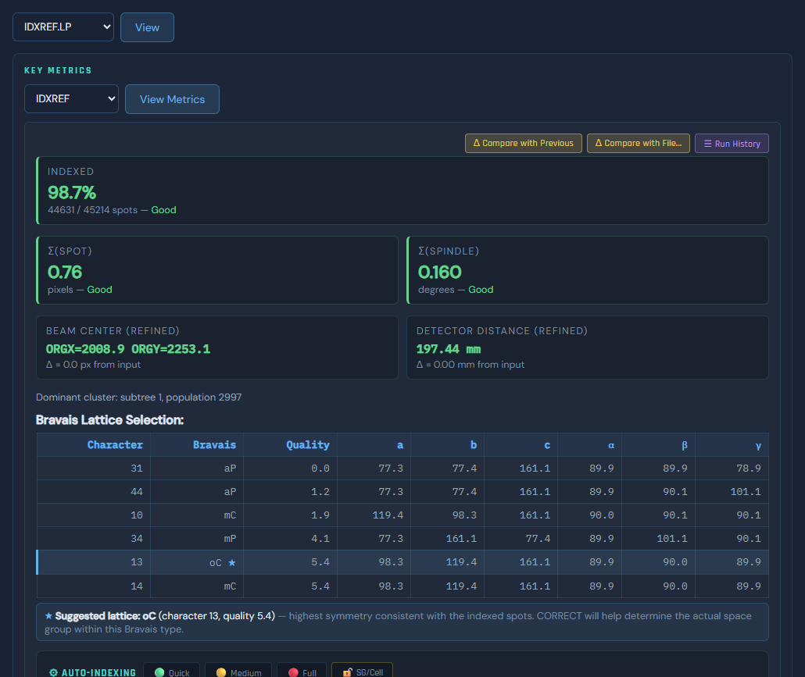

### CORRECT.LP

The whole file is available to review, while the key values are pulled out automatically and graphed.

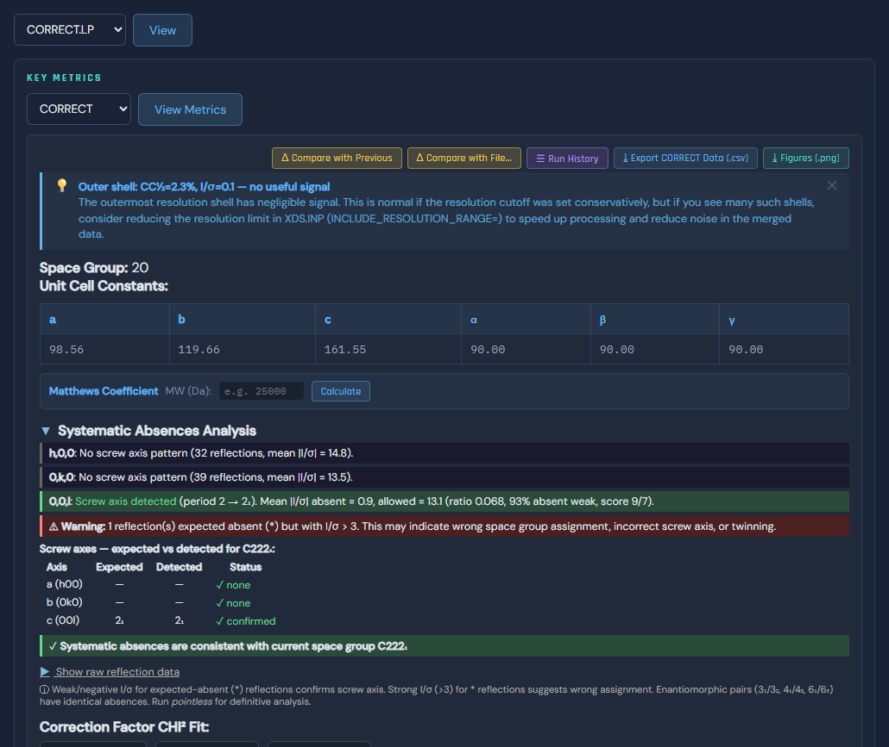

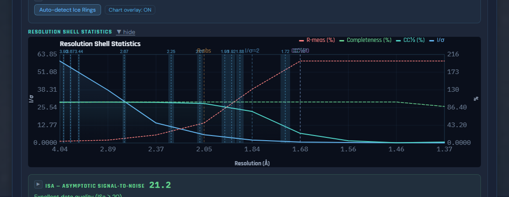

### XSCALE.LP

The common resolution cut-off criteria are highlighted directly in the statistics table and the graph, and each can be applied to XSCALE.INP in one click.

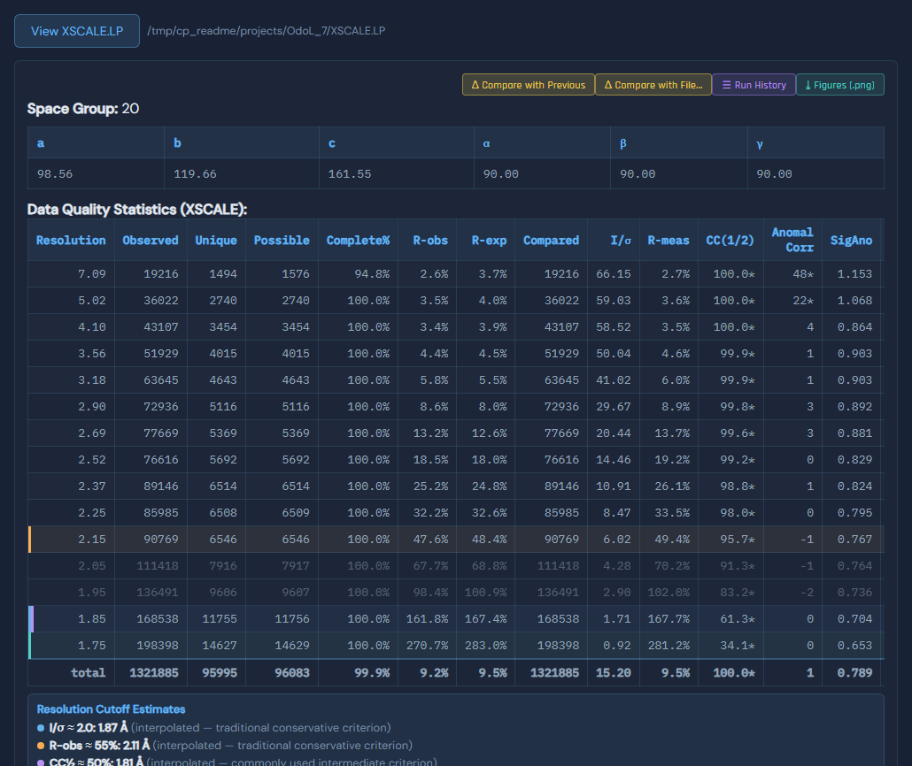

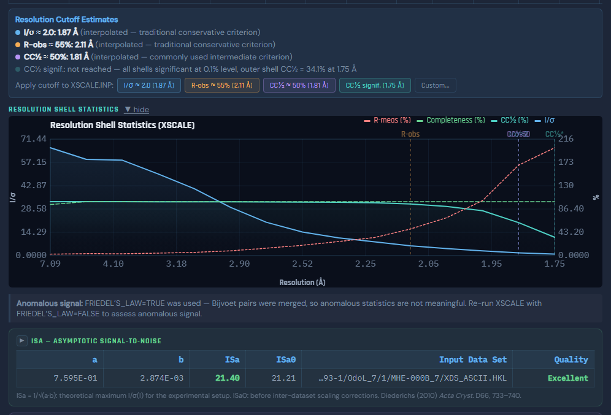

### AutoPilot

AutoPilot processes individual data sets or whole batches, including iterative auto-indexing strategies, and imports the XDS.INP already written at the beamline when one matches.

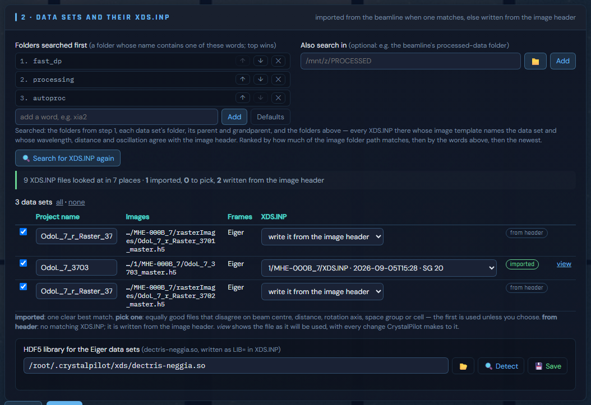

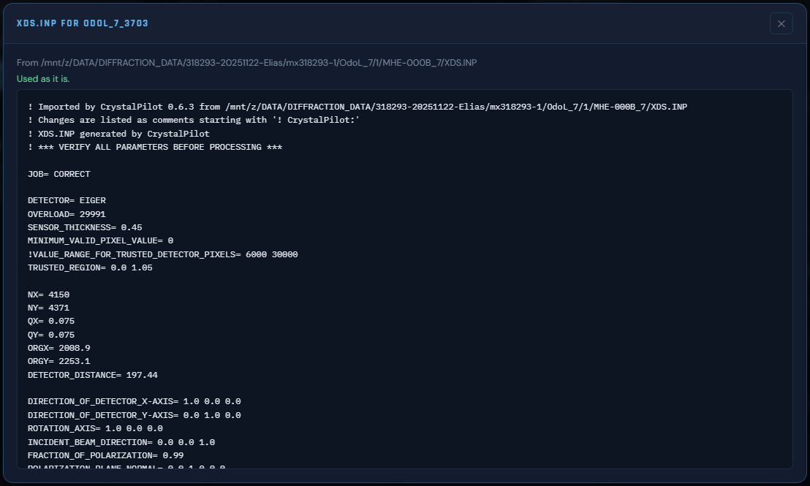

### Frame viewer

A highly capable frame viewer is integrated, with resolution and ice rings, predicted spots, contrast and colour maps.

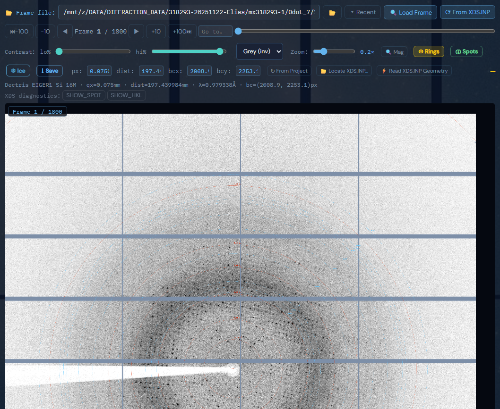

## Installation

First download from their authors (free for academic use):
- **XDS** (Linux 64-bit package): https://xds.mr.mpg.de
- **DECTRIS neggia** (`dectris-neggia.so`, for Eiger `.h5` data): https://github.com/dectris-cloud/neggia/releases
- **CCP4** (optional; needed for POINTLESS, AIMLESS and the MTZ export): https://www.ccp4.ac.uk

### Windows 10 (version 2004 or newer) / Windows 11

XDS only exists for Linux, so CrystalPilot runs inside WSL2 (built into Windows). The installer sets that up for you, and you never need a Linux terminal.

1. Leave the XDS, neggia and CCP4 downloads in your **Downloads** folder; the installer picks them up from there. Then download `CrystalPilot-Setup-<version>.exe` from [Releases](../../releases).
2. Double-click it. The installer is not code-signed, so Windows shows an *unknown publisher* notice the first time: click **More info**, then **Run anyway**.
3. **Welcome:** check the settings it has chosen (install folder `C:\CrystalPilot`, projects folder shown as `P:\Projects`, port 8000), then click **Continue**. Click **Customize…** instead to change them.
4. **Components:** XDS, neggia and CCP4 turn green when they are found in Downloads. Otherwise click **Get it** to open the download page, or **Choose file**.
5. **Installation:** follow the live log. If WSL has to be enabled, Windows asks for administrator approval and may restart once; setup then continues by itself after you log in.
6. **Finish:** start CrystalPilot from the desktop or Start-menu shortcut. It opens in your browser.

To update, run the new installer; your projects and settings are kept. To uninstall, use **Settings → Apps → CrystalPilot**.

More: [windows/README-Windows.md](windows/README-Windows.md)

### Linux

**Quick start: one file, no installation.** CrystalPilot is a single Python file that needs only Python 3.7 or newer.

1. Download `crystalpilot-<version>.py` from [Releases](../../releases) and copy it into your XDS folder (the one with `xds_par`, `xscale_par` and `xdsconv`, plus `dectris-neggia.so` for Eiger data).
2. Go to the folder where you want your projects, and start it:
   ```bash
   python3 /path/to/XDS-folder/crystalpilot-<version>.py
   ```
3. Open http://localhost:8000 in your browser. The projects are kept in a `projects` folder where you started it; Ctrl+C stops the server.

XDS is found automatically because the program sits next to it. The frame viewer needs a few Python packages, which the **Environment** screen installs with one click. Useful options: `--port 8080`, `--projects-dir DIR`, `--xds-path DIR` (when the file is not in the XDS folder).

**Full installation (desktop entry and `crystalpilot` command).** Requires Python 3.7 or newer with `venv` (Debian/Ubuntu: `sudo apt install python3 python3-venv`).

1. Unpack the XDS package (for example in `~/xds` or `/opt/xds`) and put `dectris-neggia.so` next to `xds_par`.
2. Download `CrystalPilot-<version>-linux.tar.gz` from [Releases](../../releases) and unpack it:
   ```bash
   tar xzf CrystalPilot-<version>-linux.tar.gz
   cd CrystalPilot-<version>
   ```
3. Run the installer:
   ```bash
   bash linux/install-linux.sh
   ```
   It creates a private Python environment in `~/crystalpilot`, finds XDS (in `~/xds`, `/opt/xds`, `/usr/local/xds` or on your `PATH`), neggia and CCP4, and installs the `crystalpilot` command and a desktop entry.
   If XDS is elsewhere, or CCP4 is not sourced: `bash linux/install-linux.sh --xds /path/to/XDS-folder --ccp4-setup /path/to/ccp4/bin/ccp4.setup-sh`. Other options: `--prefix DIR` (install folder), `--projects DIR` (projects folder).
4. Start it:
   ```bash
   crystalpilot
   ```
   Your browser opens the interface. `crystalpilot stop` stops the server; `crystalpilot fg` runs it in the terminal instead.

More: [linux/README-Linux.md](linux/README-Linux.md)

### First launch

The **Environment** screen lists what was found (XDS, parallel binaries, neggia, CCP4, Python packages). Anything missing gets a path field and a download link. Fix those rows, then click **Continue**.

| Component | Needed for |
|---|---|
| XDS (`xds_par`, `xscale_par`, `xdsconv`) | all processing |
| DECTRIS neggia | Eiger `.h5` data |
| CCP4 | POINTLESS, AIMLESS, MTZ export (optional) |
| XDSCC12 | ΔCC½ frame analysis (optional; the app can download it) |

## Documentation

- **Manual:** 18 illustrated chapters in `docs/manual/`, opened in the app with the 📖 Manual button and searchable from the header.
- **Docs tab:** inside the app, a reference for every control and file.

## Building from source

The application source is in `files/src`. Build the single-file application with:

```bash
cd files
py -3 build.py
```


## How to cite

If CrystalPilot helps your work, please cite it together with the programs it runs:

Elias, M. (2026). *CrystalPilot: a browser interface for XDS crystallographic data processing.* Zenodo. https://doi.org/10.5281/zenodo.22756729

## Acknowledgements

With gratitude to Wolfgang Kabsch for XDS [1, 2]; Greta Assmann, Wolfgang Brehm and Kay Diederichs for XDSCC12 [3]; Phil Evans for POINTLESS [4, 5], and Phil Evans and Garib Murshudov for AIMLESS [6]; the Collaborative Computational Project No. 4 (CCP4) for the CCP4 suite [7], including CTRUNCATE, which implements the French–Wilson procedure [8]; Marcin Wojdyr for gemmi [9]; and DECTRIS for the neggia HDF5 reader [10]. CrystalPilot’s resolution cut-off heuristics are informed by [6, 11].

CrystalPilot was coded with the help of Anthropic Claude Opus. The loading-screen artwork was created with GPT-6 Astra.

### References

1. Kabsch, W. (2010). XDS. *Acta Cryst.* D66, 125–132. https://doi.org/10.1107/S0907444909047337
2. Kabsch, W. (2010). Integration, scaling, space-group assignment and post-refinement. *Acta Cryst.* D66, 133–144. https://doi.org/10.1107/S0907444909047374
3. Assmann, G., Brehm, W. & Diederichs, K. (2016). Identification of rogue datasets in serial crystallography. *J. Appl. Cryst.* 49, 1021–1028. https://doi.org/10.1107/S1600576716005471
4. Evans, P. (2006). Scaling and assessment of data quality. *Acta Cryst.* D62, 72–82. https://doi.org/10.1107/S0907444905036693
5. Evans, P. R. (2011). An introduction to data reduction: space-group determination, scaling and intensity statistics. *Acta Cryst.* D67, 282–292. https://doi.org/10.1107/S090744491003982X
6. Evans, P. R. & Murshudov, G. N. (2013). How good are my data and what is the resolution? *Acta Cryst.* D69, 1204–1214. https://doi.org/10.1107/S0907444913000061
7. Collaborative Computational Project, Number 4 (2023). The CCP4 suite: integrative software for macromolecular crystallography. *Acta Cryst.* D79, 449–461. https://doi.org/10.1107/S2059798323003595
8. French, S. & Wilson, K. (1978). On the treatment of negative intensity observations. *Acta Cryst.* A34, 517–525. https://doi.org/10.1107/S0567739478001114
9. Wojdyr, M. (2022). GEMMI: A library for structural biology. *J. Open Source Softw.* 7, 4200. https://doi.org/10.21105/joss.04200
10. DECTRIS. Neggia: XDS plugin for DECTRIS EIGER HDF5 files. https://github.com/dectris-cloud/neggia
11. Karplus, P. A. & Diederichs, K. (2012). Linking crystallographic model and data quality. *Science* 336, 1030–1033. https://doi.org/10.1126/science.1218231

## Author

Mikael Elias

## License

Copyright © 2026 Mikael Elias. CrystalPilot is free software under the [GNU General Public License v3](LICENSE). It comes without any warranty. XDS, neggia, CCP4 and XDSCC12 are separate programs under their own licences and are not part of this repository.

## Status

CrystalPilot is still in development, and this version may contain bugs. I will do my best to fix them as they are reported. If something goes wrong, click **⚠ Report a problem** at the top of the interface: it saves a short report (version, environment, recent log, and optionally the project's input files, never the diffraction images) and opens your e-mail with the message ready to send. You can also open an issue on GitHub.
